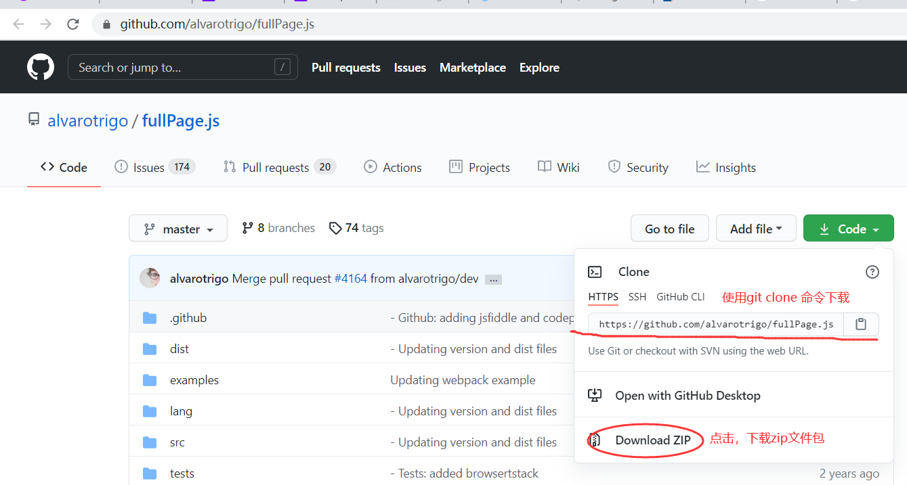

# fullpage简介与安装
fullpage 是一个用于制作全屏滚动播放动画的工具

展示页面：http://www.5shiguang.net/

技术官网：https://alvarotrigo.com/fullPage/zh/

github: https://github.com/alvarotrigo/fullPage.js

## 应用场景
展示和宣传产品的时候会使用这种大屏滚动页面。

大屏滚动页面有以下一些特点：

- 整个页面内容极少，甚至没有内容
- 一般页面比较美观大气

## 下载和安装
在上述github中下载项目



解压zip包后得到项目文件夹

找到文件夹中的 dist 文件夹

将 dist 文件夹中的内容 复制到自己项目的 css 和 js 文件夹中即可

## 将fullpage引入页面
```html
<!DOCTYPE html>
<html lang="en">

<head>
    <title>Document</title>
    <!-- 引入 css 和 js 文件即可 -->
    <link rel="stylesheet" href="./css/fullpage.min.css" />
</head>

<body>

</body>

<script src="./js/fullpage.min.js"></script>

</html>
```